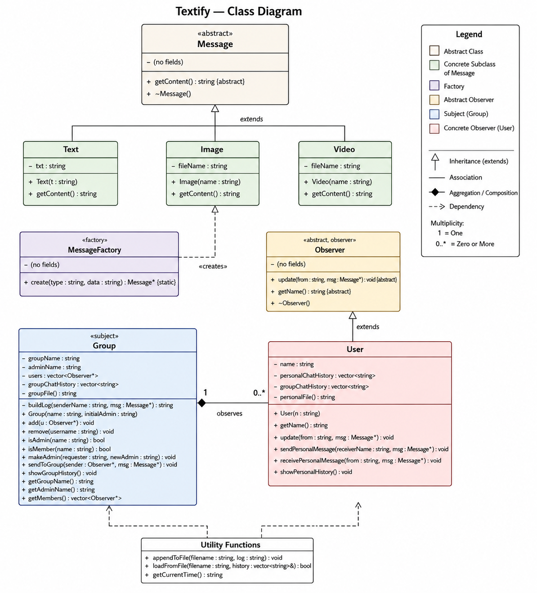
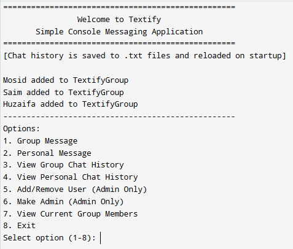
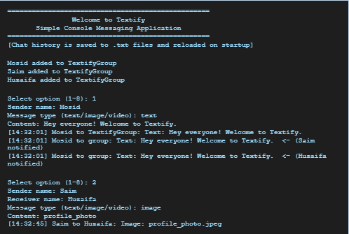
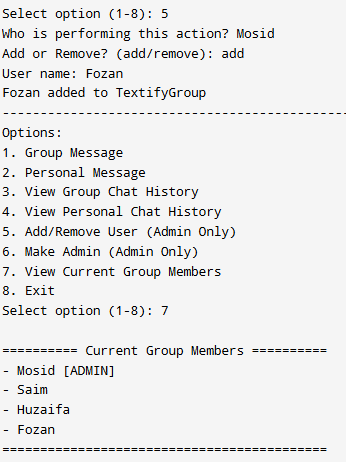

<div align="center">

# 💬 Textify – Messaging System

### Console-Based OOP Chat Application

*A structured group & personal messaging system built using C++ and Object-Oriented Programming*


</div>

---

## 📌 Overview

**Textify** is a console-based messaging application developed in **C++ (OOP approach)**.  
It simulates a simplified chat system where users can communicate through **personal messages and group chats**, manage group members, and maintain chat history using file handling.

The project focuses on applying core **Object-Oriented Programming principles** in a real-world communication system.

---

## ✨ Features

| Category | Capabilities |
|---|---|
| 📨 **Messaging** | Group broadcasts, private DMs, text / image / video message types |
| 👥 **Group Management** | Admin-controlled add/remove, role transfer, member listing |
| 💾 **Persistence** | Chat history saved to `.txt` files and auto-reloaded on startup |
| 🖥️ **Interface** | Clean interactive console loop with 8 menu options |

---

## 🏗️ Architecture

Textify is built around a clean class hierarchy implementing three classic design patterns:

```
Message (Abstract)          Observer (Interface)        Group (Subject)
├── Text                    └── User                    └── holds vector<Observer*>
├── Image                       ├── personalChatHistory     └── notifies all members
└── Video                       └── groupChatHistory

MessageFactory              Utility Functions
└── create(type, data)      ├── appendToFile()
    └── returns Message*    └── loadFromFile()
```

### Design Patterns

| Pattern | Applied In | Purpose |
|---|---|---|
| **Factory** | `MessageFactory::create()` | Decouples message instantiation from business logic |
| **Observer** | `Group` → `User` | One-to-many notification without tight coupling |
| **Polymorphism** | `Message*` base pointer | Runtime dispatch via virtual `getContent()` |

### OOP Principles

- **Encapsulation** — All data members are private; state is accessed only through public interfaces
- **Abstraction** — `Message` and `Observer` define pure virtual contracts; code targets abstractions, not concretes
- **Inheritance** — `Text`, `Image`, `Video` extend `Message`; `User` extends `Observer`
- **Polymorphism** — `Message*` and `Observer*` pointers enable runtime-resolved behavior throughout

---

## 🗂️ UML Class Diagram



> Full diagram showing all classes, inheritance chains, associations, and multiplicities between `Message`, `Observer`, `User`, `Group`, `MessageFactory`, and utility functions.

---

## 📂 Project Structure

```
Textify/
├── main.cpp                  # Full application source
├── class_uml_diagram.png     # UML class diagram
├── docs/
│   └── Textify_Project_Report_final.pdf
├── screenshots/
│   ├── menu.png
│   ├── demo.png
│   ├── admin_check.png
│   ├── member_management.png
│   └── view_members.png
├── .gitignore
├── LICENSE
└── README.md
```

### Generated at Runtime

```
TextifyGroup_chat.txt         # All group messages (timestamped)
Huzaifa_personal.txt          # Per-user personal message history
Saim_personal.txt
Mosid_personal.txt
<NewUser>_personal.txt        # Auto-created for dynamically added users
```

---

## 🚀 Build & Run

### Requirements
- C++17 compatible compiler (`g++ 7+` or `clang++ 5+`)
- Standard library only — no external dependencies

### Linux / macOS
```bash
g++ -std=c++17 -Wall -o textify main.cpp
./textify
```

### Windows (MinGW)
```bash
g++ -std=c++17 -Wall -o textify.exe main.cpp
textify.exe
```

---

## 🖥️ Menu Options

```
==================================================
         Welcome to Textify
     Simple Console Messaging Application
==================================================

  1  →  Send Group Message
  2  →  Send Personal Message
  3  →  View Group Chat History
  4  →  View Personal Chat History
  5  →  Add / Remove Member       [Admin only]
  6  →  Transfer Admin Role        [Admin only]
  7  →  View Group Members
  8  →  Exit
```

---

## 📸 Screenshots

| Menu | Demo | Member Management |
|---|---|---|
|  |  |  |

---

## 📋 Sample Session

```
Mosid added to TextifyGroup
Saim added to TextifyGroup
Huzaifa added to TextifyGroup

Select option (1-8): 1
Sender name: Mosid
Message type (text/image/video): text
Content: Hey everyone! Welcome to Textify.

[14:32:01] Mosid to TextifyGroup: Text: Hey everyone! Welcome to Textify.
[14:32:01] Mosid to group: Text: Hey everyone! Welcome to Textify. <- (Saim notified)
[14:32:01] Mosid to group: Text: Hey everyone! Welcome to Textify. <- (Huzaifa notified)

Select option (1-8): 2
Sender name: Saim
Receiver name: Huzaifa
Message type (text/image/video): image
Content: profile_photo

[14:32:45] Saim to Huzaifa: Image: profile_photo.jpeg
```

---

## ⚠️ Known Limitations

- Single-threaded — no concurrent message simulation
- No user authentication or password protection
- Username lookup is case-sensitive
- Plain-text file storage (no encryption)
- No message editing or deletion

---

## 🔮 Future Improvements

- [ ] GUI version (Qt or SFML)
- [ ] Login & authentication system
- [ ] Database integration (MySQL / SQLite)
- [ ] Add message search and filtering
- [ ] Encryption for messages

---

## 👥 Team

| # | Name | Roll No |
|---|---|---|
| S1 | Huzaifa Jawed | CT-24077 |
| S2 | Saim Uz Zaman | CT-24078 |
| S3 | Muhammad Mosid Khan | CT-24100 |

**Department of Computer Science & Information Technology**  
OOP Course Project · Built with C++17

---

<div align="center">
  <sub>Made with ❤️ using C++ · OOP Principles · Design Patterns</sub>
</div>
